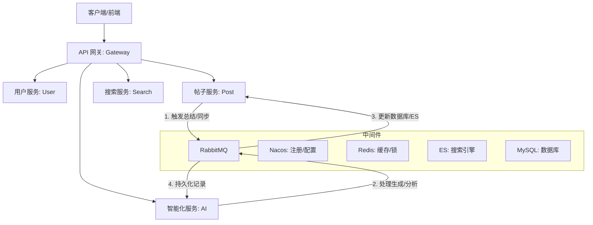

# 面向排序算法教学的 RAG 增强型交互式系统

本项目致力于打造一个**面向排序算法教学的 RAG（检索增强生成）增强型交互式系统**。基于 **Spring Cloud Alibaba** 深度构建，采用 **Java 21** 和 **Spring Boot 3.5.9**
技术栈，集成了大模型（LLM）与领域知识库，为学习者提供智能化的算法讲解、实时互动与个性化辅导。

## 🌟 项目亮点

- **前沿技术栈**：全面拥抱 Java 21 特性，集成 Spring Boot 3.5.x 与 Spring Cloud 2025。
- **完善的微服务生态**：全方位的服务矩阵，包括 AI 服务、全文检索、实时通信等。
- **智能化增强**：集成 **Spring AI** 大模型能力，支持大模型（DashScope）的深度应用。
- **AI 赋能业务**：支持**帖子自动总结**与**异步数据一致性**，通过 RabbitMQ 实现 AI 结果的稳健持久化。
- **高性能异步架构**：基于 RabbitMQ 实现对话记录持久化、搜索同步等关键流程，极大地提升了系统的响应并发。
- **全链路日志采集**：集成了详尽的操作日志、API 访问日志以及 AI Token 使用追踪体系，支持 ELK 日志收集。

## 🏗️ 架构概览



### 服务模块说明

| 模块名称                           | 功能描述                    | 端口   |
|:-------------------------------|:------------------------|:-----|
| `algorithm-gateway`              | API 网关：路由转发、鉴权、限流       | 8080 |
| `algorithm-user-service`         | 用户服务：账号、权限、多端登录         | 8081 |
| `algorithm-post-service`         | 帖子服务：内容、互动、数据统计         | 8082 |
| `algorithm-notification-service` | 通知服务：系统消息、实时推送          | 8083 |
| `algorithm-search-service`       | 搜索服务：基于 ES 的聚合检索        | 8084 |
| `algorithm-file-service`         | 文件服务：对象存储 (COS)   | 8085 |
| `algorithm-log-service`          | 日志服务：全链路日志采集与存储         | 8086 |
| `algorithm-mail-service`         | 邮件服务：验证码、告警发送           | 8087 |
| `algorithm-ai-service`           | AI 服务：Spring AI 大模型集成 | 8089 |

## 🎯 技术栈

| 领域        | 核心技术                 | 版本           |
|:----------|:---------------------|:-------------|
| Java 运行环境 | JDK                  | 21           |
| AI 框架      | Spring AI          | 1.1.2        |
| 核心框架      | Spring Boot          | 3.5.9        |
| 微服务治理     | Spring Cloud Alibaba | 2025.0.0.0-RC1   |
| 服务网关      | Spring Cloud Gateway | 5.0.1        |
| 数据库       | MySQL                | 8.4.0        |
| 持久层框架     | MyBatis-Plus         | 3.5.12       |
| 缓存/分布式锁   | Redis & Redisson     | 7.0 / 3.48.0 |
| 消息队列      | RabbitMQ             | 3.12         |
| 搜索引擎      | Elasticsearch        | 8.19.10      |
| 通讯框架      | Netty                | 4.2.5.Final  |
| 认证鉴权      | Sa-Token             | 1.44.0       |
| 监控配置: Actuator | Spring Boot Actuator | 3.5.9 |

## 📮 消息队列 use 指南

项目通过 `algorithm-common-rabbitmq` 模块对 RabbitMQ 进行了封装，实现了**生产端统一发送**与**消费端自动化分发**。

### 1. 生产者 (Producer)
注入 `RabbitMqSender` 即可发送消息。
- **普通发送**：`mqSender.send(bizType, data)`
- **事务发送**：`mqSender.sendTransactional(bizType, data)`（当前实现为兼容历史 API，语义已降级为立即发送）。

### 2. 消费者 (Consumer)
1. **定义 Handler**：实现 `RabbitMqHandler<T>` 接口并注入为 Bean，标记 `@RabbitMqDedupeLock` 进行分布式去重。
2. **统一调度**：在具体的 `@RabbitListener` 中调用 `mqConsumerDispatcher.dispatch(rabbitMessage, channel, msg)`，系统将根据 `bizType` 自动匹配 Handler 及其对应的 DTO 类型。

> 更多细节请参考 [RabbitMQ 模块文档](algorithm-common/algorithm-common-rabbitmq/README.md)。

## 📋 日志与多环境

- **两类日志**
  - **ELK（运行时）**：各服务通过 `logback-spring.xml` 输出到控制台；**生产环境**下 additionally 通过 TCP 上报到 Logstash → ES → Kibana，用于运维排障与监控。
  - **业务审计**：操作日志、登录日志、API 访问日志、邮件/文件记录由 **algorithm-log-service** 接收并落库 MySQL，供管理端分页查询。
- **多环境**
  - **本地/默认**（未设置 `spring.profiles.active=prod`）：仅控制台输出，**不连接 Logstash**，本地不部署 ELK 也不会报错。
  - **生产**（`spring.profiles.active=prod`）：控制台 + 异步 TCP 输出到 Logstash；需保证与 `docker-compose-env.yml` 中的 `logstash` 服务同网，且 Nacos 使用 `common-web-prod.yml` 中的 `logstash.host: logstash`。
- **配置位置**：`algorithm-common-core/src/main/resources/logback-spring.xml`（按 profile 启用 Logstash）；Nacos：`common-web.yml` / `common-web-prod.yml` 中的 `logstash.*`。

## 🚀 快速启动

### 1. 基础环境

确保已安装 **Docker** 与 **Docker Compose**，在根目录下运行：

```bash
docker-compose up -d
```

这将启动 MySQL, Redis, RabbitMQ, Nacos, ES 等所有中间件。

### 2. 初始化数据库

参考 `sql/README.md` 执行相关数据库脚本。

### 3. 配置中心

1. 访问 Nacos 控制台 (默认 `localhost:8848/nacos`)。
2. 将 `nacos-config/common-secret.properties.example` 重命名为 `common-secret.properties` 并填入您的真实密钥。
3. 运行 `nacos-config/import-config.sh` (或手动导入) 导入配置文件。

### 4. 编译与运行

```bash
mvn clean install -DskipTests
# 启动各个 Service 模块的 Application 类
```

### 5. 生产/服务器部署

- 使用 **docker-compose** 时：先启动基础设施 `docker-compose -f docker-compose-env.yml up -d`，确认 Nacos/MySQL/Redis 等就绪后，在 `.env` 中配置 `NACOS_HOST`、`NACOS_PORT` 等，再 `docker-compose up -d` 启动各微服务；所有服务已设置 `SPRING_PROFILES_ACTIVE=prod` 并从 Nacos 拉取 prod 配置。
- **非 Docker 部署**：启动时加 `--spring.profiles.active=prod`，并必须设置环境变量 `SPRING_CLOUD_NACOS_CONFIG_SERVER_ADDR`、`SPRING_CLOUD_NACOS_DISCOVERY_SERVER_ADDR` 为实际 Nacos 地址（如 `192.168.1.10:8848`），否则会使用 localhost 无法连接。
- 生产 Nacos 中需已导入并维护好 `common-secret-prod.properties` 及各项 `*-prod.yml`；Logstash 仅 prod 启用，需与应用同网（如 docker-compose-env 中 logstash 与应用同属 `algorithm-network`）。详见 `nacos-config/README.md`。

---

**维护者**: StephenQiu30  
**许可证**: [Apache License 2.0](LICENSE)
