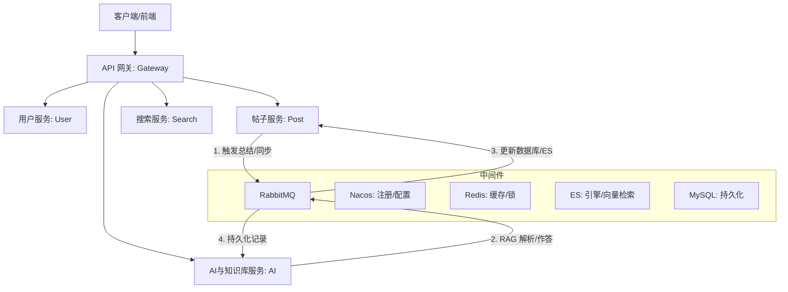

# 面向排序算法教学的 RAG 增强型交互式系统

本项目致力于打造一个**面向排序算法教学的 RAG（检索增强生成）增强型交互式系统**。基于 **Spring Cloud Alibaba** 深度构建，采用 **Java 21** 和 **Spring Boot 3.5.9** 技术栈，集成了大模型（LLM）与领域知识库，为学习者提供智能化的算法讲解、实时互动与个性化辅导。

本项目已经在 GitHub 端全面开源，旨在为计算科学及教育领域的同仁提供参考，并与开源社区共同演进。

## 🌟 项目亮点与核心优势

- **RAG 增强赋能教学**：针对“排序算法”这一垂直图谱，通过检索增强生成（RAG）打破通用大模型在教学细节与复杂度上的“幻觉”，提供精准到行级的代码解析和严谨的时间/空间复杂度说明。
- **智能化增强与大模型流式交互**：集成 **Spring AI (1.1.2)** 与阿里云 DashScope (通义千问 qwen-plus & text-embedding-v2)，支持基于 SSE 的流式逐字回显。
- **全异步高性能流水线**：包括知识库解析、对话摘要总结、数据 ES 同步等，均通过 RabbitMQ 实现异步削峰解耦，具备极高的并发与健壮性。
- **前沿微服务与全链路日志**：全面拥抱 Java 21 协程与 Spring Boot 3.5.x，支持 ELK（Logstash + ES + Kibana）的全链路业务与异常监控。

---

## 🧠 核心架构深入解析：RAG 增强型 ETL 切片与 ES 双路召回

本项目针对“算法教学”这一垂类场景，放弃了传统的粗粒度文档问答方案，转而深度定制了一套基于**异步并发的 ETL 知识向量化流水线**与**多模态组合的 Elasticsearch 双路召回系统**。这套架构完美解决了大模型在处理复杂教学代码上下文时容易出现的逻辑截断与关键概念遗漏问题。以下为您详细剖析这套机制的运作原理：

### 1. 深度定​​制的 RAG 增强型 ETL 检索切片 (ETL Document Chunking)

在算法课件（如 PDF、Word 讲义或 Markdown 代码笔记）进行入库知识化的过程中，最大的挑战在于：如何使得抽取出的上下文既涵盖完整的算法教学逻辑（比如一整段完整的冒泡排序推导），又能适配于 LLM 模型在每次提问时产生的上下文窗口大小。为了攻克这一难题，系统构建了一条基于 RabbitMQ 驱动的、高可靠自动化的 ETL（Extract-Transform-Load）流水线。

- **阶段一：异步削峰与容灾 (Extract)**  
  当用户或讲师在系统前台上传课件时，文件服务完成对象存储（COS/MinIO）上传并落库 MySQL 后，系统将立刻释放 HTTP 线程，向 RabbitMQ 投递 `KnowledgeDocIngestMessage`。消费者线程池 `KnowledgeDocIngestConsumer` 在后端静默拉取解析任务。这种设计彻底避免了由于大文件解析或远程 LLM Embedding 调用造成的服务接口阻塞甚至 OOM，赋予了架构极高的并发吞吐量与稳定性。在消费端，程序会利用 `HttpUtil` 或本地缓存下载对应的课件实体，并挂载 `DocumentTextExtractor` 支持对海量不同格式文档的无感知全文解析抽取。

- **阶段二：智能语义预算合并与超精细切片 (Transform)**  
  当原始文本被抽取后，由于教学文档通常存在大量的回车符、格式控制符以及随意的排版空白，系统会首先通过自定义的 `ContentTextCleaner` 组件进行全量排版净化，为切片做好准备。接下来，文档将进入最核心的 `TextChunker`（文本处理器）。传统的算法教学笔记如果被生硬地按固定字数切开，往往会导致前一句讲“时间复杂度”，下一句说明却被切到了另一个 Chunk 里，模型最终回答时将因为上下文割裂而发生严重的“幻觉”。  
  由于此原因，本系统在此处创新性地引入了 **“合并预算 (Paragraph Merge Budget)”** 机制：在切片前，程序以段落（空行分隔）为粒度对全文进行遍历；只要连续几个段落的总字数没有超过我们预设的阈值（如 800-1000 字符），系统就会优先将其合并为一个宏大的“语义块”。只有当语义块本身超过安全阈值界限时，它才会被移交给底层的 Spring AI `TokenTextSplitter` 进行进一步切割。并且，在后续的切割过程中，系统严格启用了 Overlap (重叠窗口) 规则。这意味着每两个相邻被切割的文本之间，都会有数十个字符的重叠区间，使得“承上启下”的逻辑与代码引用在向量空间中永远不会彻底断链。

- **阶段三：高维特征对齐与统一持久化 (Load)**  
  经过这重重把关，精准切分完毕的 `document_chunk` 将被正式写入数据库进行结构化存储。同时，每一份分片的全文都会被调用外网阿里云 DashScope (通义千问 `text-embedding-v2`) 进行高达数千维的特征提取，这些向量会随同关键特征的 Metadata (比如 `knowledgeBaseId`, `documentId`, `chunkId`) 整体通过 `VectorStoreService` 并发推进入 Elasticsearch 进行分布式索引覆盖。

### 2. 精密融合的 Elasticsearch 双路召回设计 (Dual-Path Hybrid Recall)

当用户在交互式系统中向人工智能助教发起提问时（例如问：“冒泡排序和选择排序的空间占用分别是多少？”），单一路线的检索方案往往存在缺陷：
纯粹依赖 Dense Vector（稠密向量）搜索的 KNN 近邻算法确实能理解“空间占用”和“内存复杂度”在语义上是相同的，但它却经常在如特定专有名词、具体的算法代码英文缩写上发生失焦。而传统的词条匹配（Elasticsearch BM25）则对“冒泡排序”字眼极为敏感，但对语义替换非常无力。

因此，我们在底层直接封装了 `VectorSimilarityStrategyRegistry` (向量相似度策略注册表)，为该业务独创了 **Hybrid 双路并行召回机制**，并在最上层的 RAG 对话链路 (`RagServiceImpl`) 中做到对上层 API 彻底透明的无感调度。具体运作步骤包含以下三个维度的无缝融合：

- **第一路：基于通义千问的 KNN Dense 向量意图检索**  
  系统截获用户的提问后先实时进行一遍通义千问的 Embedding 转化。带着这个高维特征向量矩阵，通过 Spring AI 的 `SearchRequest` 到 Elasticsearch Vector Store 执行 Cosine Similarity（余弦相似度）计算。ES 在底层扫描与之在语义空间最靠近的 Top-K 份历史文本切片。这一步能有效回答模糊查询、语义衍生以及归纳性问题，保证系统能“听懂”言外之意。

- **第二路：基于 ES 分词与 TF-IDF 升级版 (BM25) 的稀疏词法拦截**  
  在执行第一路请求的同时，我们在 `HybridVectorSimilarityStrategy` 内部开启并行协程通过直接干预 Elasticsearch Client 向 ES 发起传统 DSL 查询。我们在所有课件的核心明文字段 `content` 之上，指定 `TextQueryType.BestFields` 的 `multiMatch` 倒排匹配策略。如果用户输入了极度核心的代码块、专有术语（如 `quickSort(arr, low, high)`），该条路径能凭借极高的关键词纯净度权重瞬间捕捉到含有原版名词的教材原始分段，确保技术教学的“行级代码精准”。

- **第三路：基于 RRF (Reciprocal Rank Fusion) 的智能倒数融合重打分排序**  
  两路召回分别携带不同的打分指标（一边是向量相似度空间中的相对距离 Cosine Score，另一边是关键词词频权重模型带来的 BM25 Score），由于两个分数处于完全不同的数据尺度，简单地做相加是毫无统计学意义的。因此，我们严格引入并实现了信息检索领域的经典 RRF 倒数秩融合算法。  
  在系统后台，它将把所有的召回命中结果放在一起摊平，按照各自所在子路径取得的名字次序（Rank）引入平滑系数 K（默认通常为 60），重新计算其融合信度基数：`score = 1.0 / (k + rank)`；如果有文档在两路算法中均被提取到，则累加这双份结果。最后，以最终的总合排名抽出最匹配的综合相关段落提交至大模型进行 Context 上下文填充系统模版，完美打通了这一整条闭环教学流程。

---

## 🏗️ 整体微服务矩阵



### 服务模块说明

| 模块名称                           | 功能描述                    | 端口   |
|:-------------------------------|:------------------------|:-----|
| `algorithm-gateway`              | API 网关：路由转发、鉴权、限流       | 8080 |
| `algorithm-user-service`         | 用户服务：账号、权限、多端登录         | 8081 |
| `algorithm-post-service`         | 帖子服务：内容、互动、数据统计         | 8082 |
| `algorithm-notification-service` | 通知服务：系统消息、实时推送          | 8083 |
| `algorithm-search-service`       | 搜索服务：基于 ES 的聚合检索        | 8084 |
| `algorithm-file-service`         | 文件服务：腾讯云对象存储 (COS)     | 8085 |
| `algorithm-log-service`          | 日志服务：全链路日志采集与审计存储      | 8086 |
| `algorithm-mail-service`         | 邮件服务：验证码、告警发送           | 8087 |
| `algorithm-ai-service`           | AI 枢纽：RAG流水线与大模型集成 | 8089 |

## 🎯 核心技术栈

| 领域        | 核心技术                 | 版本           |
|:----------|:---------------------|:-------------|
| 运行环境 | Java (JDK) | 21           |
| AI 框架      | Spring AI          | 1.1.2        |
| 核心框架      | Spring Boot          | 3.5.9        |
| 微服务治理     | Spring Cloud Alibaba | 2025.0.0.0-RC1   |
| 数据库       | MySQL                | 8.4.0        |
| 缓存/分布式锁   | Redis & Redisson     | 7.0 / 3.48.0 |
| 消息队列      | RabbitMQ             | 3.12         |
| 搜索引擎/向量库  | Elasticsearch        | 8.19.10      |
| 通讯框架      | Netty                | 4.2.5.Final  |

---

## 🚀 快速启动

### 1. 基础依赖环境

确保已安装 **Docker** 与 **Docker Compose**，在根目录下运行基础环境挂载：

```bash
docker-compose up -d
```
基础设施（MySQL, Redis, RabbitMQ, Nacos, Elasticsearch）启动完毕。

### 2. 初始化数据库

参考 `sql/README.md` 执行相关核心库及业务表的初始化 SQL 脚本。

### 3. Nacos 配置导入

1. 访问 Nacos 控制台 (默认 `localhost:8848/nacos`)，登录 `nacos/nacos`。
2. 将 `nacos-config/common-secret.properties.example` 复制重命名为 `common-secret.properties` 并补充阿里云 `dev.aliyun.dashscope.api-key` 以及 OSS 连接凭证。
3. 运行 `nacos-config/import-config.sh` 将所需的配置一键推入。

### 4. 源码部署

```bash
mvn clean install -DskipTests
# 使用 IDE 启动各个 *-Service 模块的入口 Application 类
```

### 5. 生产容器部署（可选）
生产模式需在 Nacos 中补充 `-prod` 配置文件，以 `docker-compose-env.yml` 搭配应用本身的 `Dockerfile`。

---

> _**"让复杂的算法，在流式的自然问答中化繁为简。"**_
> 
> 欢迎各界开发者 Fork 与提 PR。如遇到问题，欢迎提交 Issue。

**维护者**: StephenQiu30  
**许可证**: [Apache License 2.0](LICENSE)
