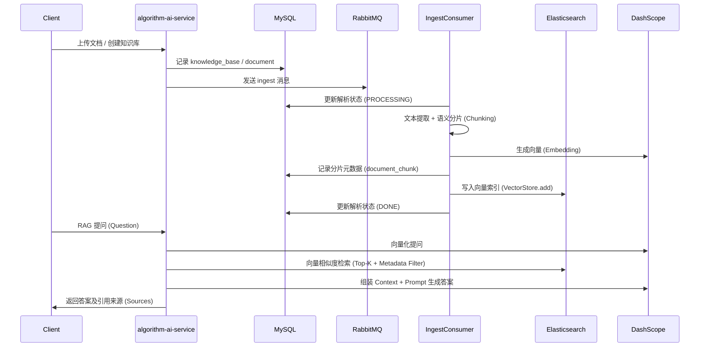

# algorithm-ai-service - 智能服务与 RAG 知识库

`algorithm-ai-service` 是 `algorithm-cloud` 的 AI 枢纽，集成了 Spring AI 与 DashScope (通义千问)，提供标准的生成式对话能力及高性能的 **RAG (Retrieval-Augmented Generation) 增强型私有知识库** 系统。

## 🌟 核心功能

- **RAG 增强型对话**：整合向量数据库检索与 LLM 生成，实现基于私有文档（PDF, Word, MD, TXT）的精准问答。
- **多模型流式交互**：核心接口采用 **SSE (Server-Sent Events)** 协议，支持实时逐字回复。
- **异步文档解析流水线**：基于 **RabbitMQ** 实现文档上传、解析、切片、向量化的全自动异步处理。
- **多租户数据隔离**：支持多知识库管理，通过元数据过滤确保用户间及库间的数据安全隔离。
- **Token 统计与持久化**：自动追踪对话消耗，记录 Prompt/Completion Tokens 并异步存入数据库。

## 🏗️ 系统架构与数据流

## 📊 数据库设计 (MySQL)

| 表名 | 说明 |
| :--- | :--- |
| `knowledge_base` | **知识库主体**：存储名称、描述、所有者 ID 及启用状态。 |
| `document` | **文档元数据**：存储原始文件名、存储路径、MIME 类型及解析状态（PENDING/DONE/FAILED）。 |
| `document_chunk` | **文本分片**：存储分片后的纯文本内容及对应的 Token 指数。 |
| `embedding_vector` | **向量关联表**：记录向量主体的 ID、模型维度，确保与 ES 数据的唯一映射。 |

## 🛠️ 技术栈

- **AI 框架**: [Spring AI 1.1.2](https://spring.io/projects/spring-ai)
- **大模型**: 阿里云 DashScope (通义千问 qwen-plus & text-embedding-v2)
- **向量数据库**: Elasticsearch (基于 Spring AI Elasticsearch VectorStore)
- **核心框架**: Spring Boot 3.5.9
- **消息队列**: RabbitMQ (异步处理流水线)
- **数据库**: MySQL 8.4
- **ORM**: MyBatis-Plus 3.5.12

## 📡 核心 API

### 知识库管理
- `POST /knowledge/add`: 创建新知识库
- `POST /knowledge/delete`: 删除知识库及其关联数据
- `POST /knowledge/list/page/vo`: 分页获取知识库列表

### 文档处理
- `POST /knowledge/document/upload`: 上传文档并开启异步解析
- `GET /knowledge/document/get/vo`: 查询文档解析进度与元数据

### AI 对话
- `POST /chat/doChat`: 标准同步 AI 对话
- `POST /chat/streamChat`: 实时流式 AI 对话 (SSE)
- `POST /knowledge/chat`: 基于特定知识库的 RAG 问答

## 🚀 快速启动

1. **配置 Nacos**: 确保 `algorithm-ai-service` 能正确加载 `common-elasticsearch.yml` 与 `common-secret.properties`。
2. **环境变量**:
   - `dev.aliyun.dashscope.api-key`: 阿里云 DashScope 密钥。
   - `dev.elasticsearch.uris`: Elasticsearch 连接地址。
3. **运行服务**: 端口默认为 `8089`。

---

**维护者**: StephenQiu30  
**版本**: 1.0.0
